# Get Folder
1.```git clone "app"```

# Exec db
1.```docker-compose up -d```
1.```Testar db dbeaver```

# Env
1.```python -m venv .venv```
2.```.venv\Scripts\activate```
3.```pip install -r requirements_dev.txt```
 
# Exec
1.```python app/main.py```
1.```Testar no /localhost:8003/docs```

# Images

## Docker
1.```Criar uma imagem do PostgreSQL (docker-composer.yml)```
   <br>
   <b>lucasleal-postgree (container)<b>
  <br>
## Dbeaver
1.```Testar conexão com o banco de dados```
   <br>
   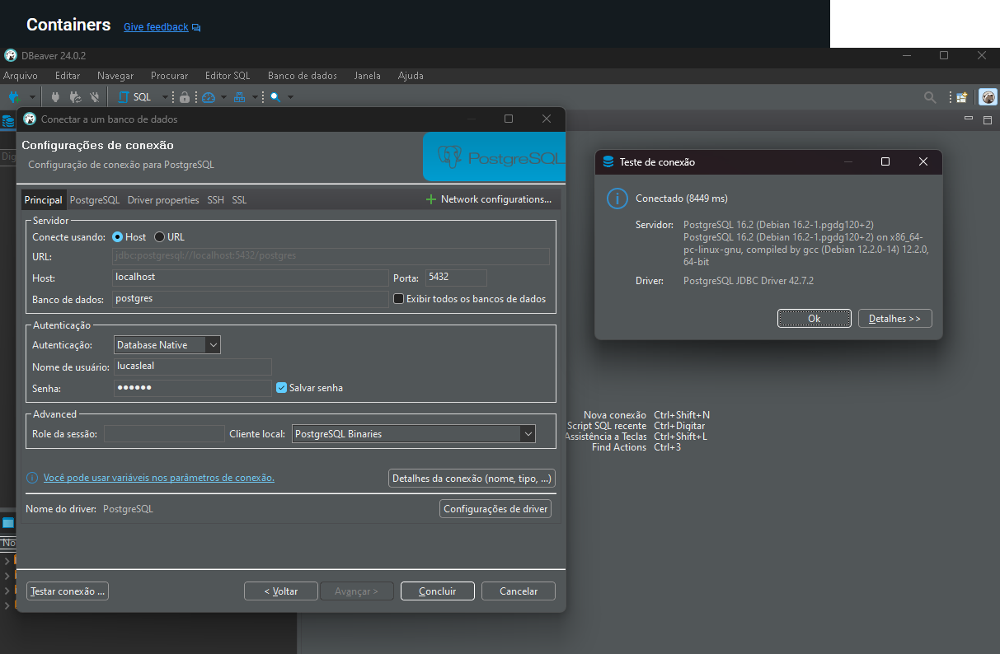<br>
   <br><br>
2.```TB USUARIOS```
   <br>
   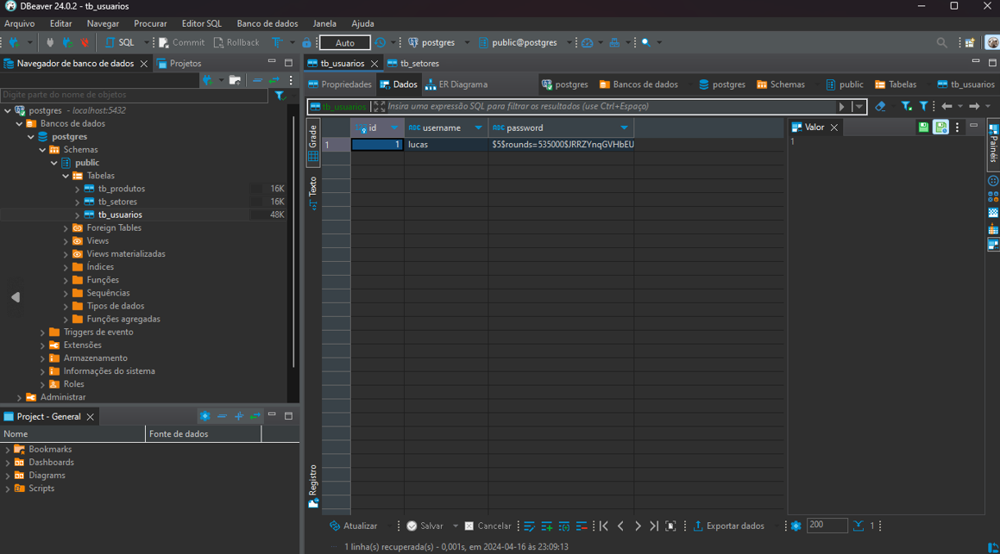<br>
    <br>
   ```TB USUARIOS ATUALIZADA```
   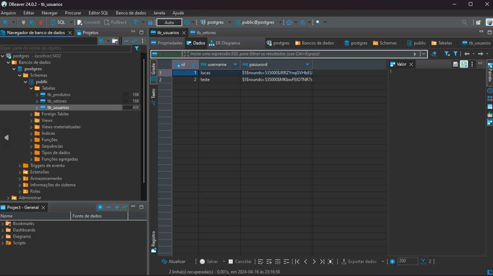<br><br>
3.```TB SETOR e TB PRODUTOS```
   <br>
   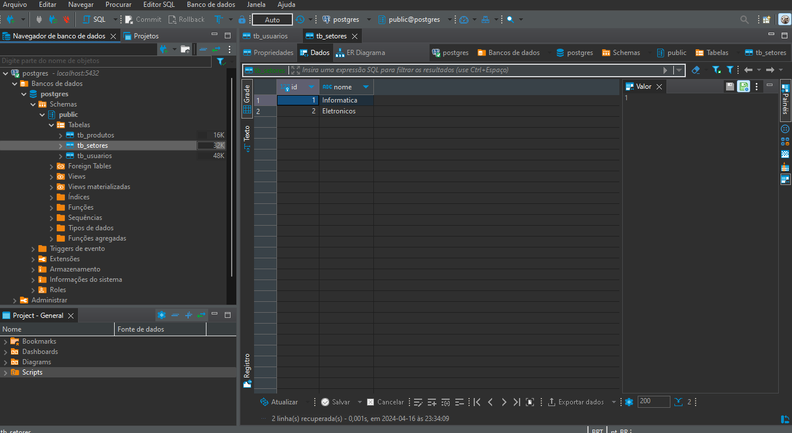<br>
   <br>
   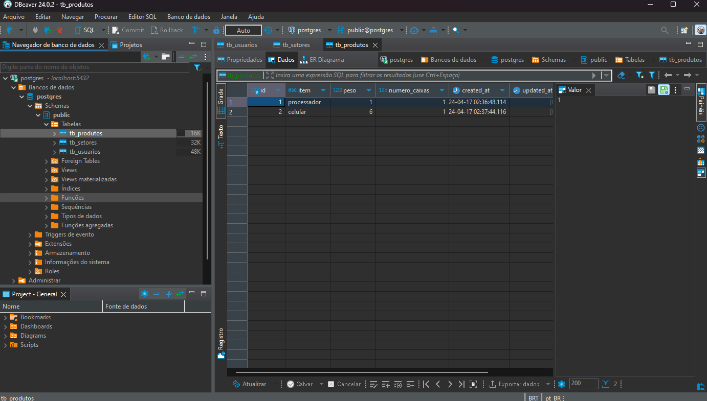<br>

## Swagger
1.```Abrir o swagger para testar os metodos```
   <br>
 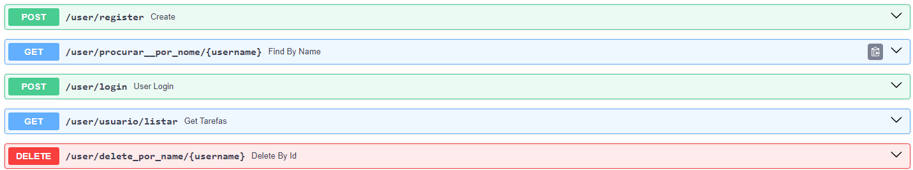<br>
  <br><br>
## Metodo registrar
1.```User: Lucas```
   <br>
   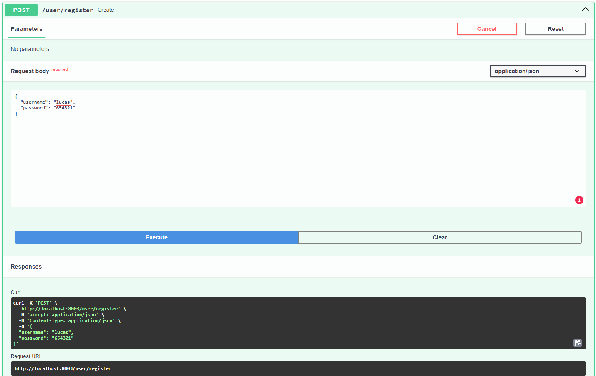<br><br><br>
2.```User: Teste```
   <br>
   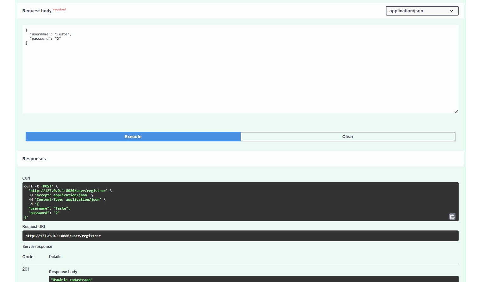<br><br><br>
## Listar usuarios
1.```Listar usuarios```
   <br>
  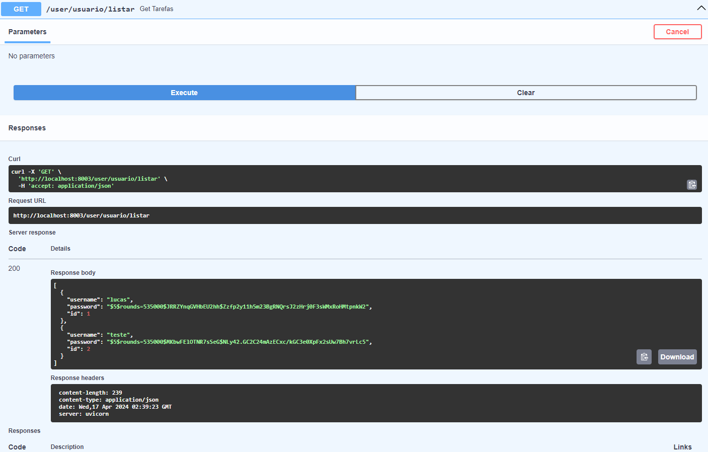<br>
  <br><br>
## Procurar por nome
1.```Procurar por nome```
   <br>
  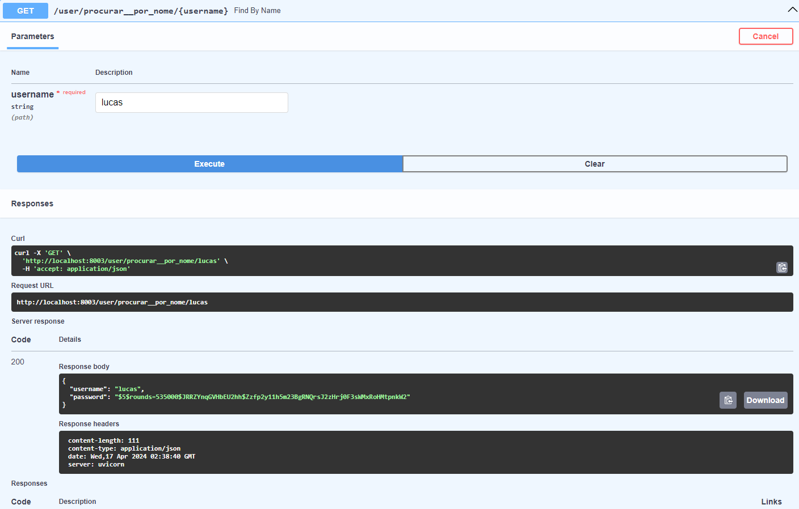<br>
  <br><br>
## Autorização
1.```Autorização negada```
   <br>
    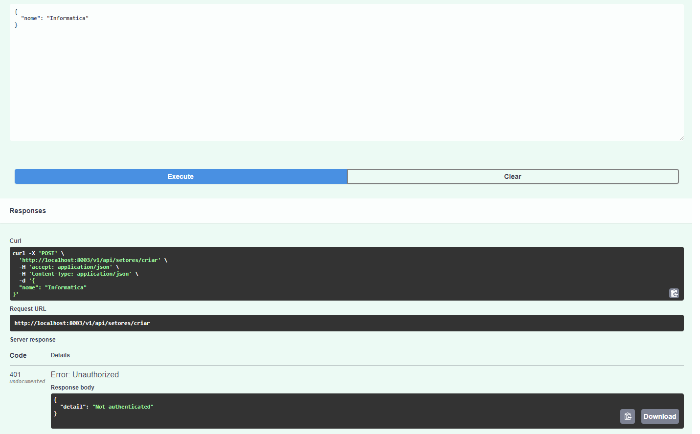<br>
  <br><br>
           <br>
## Login de Usuarios
1.```User: Lucas```
   <br>
  <br>
  <br><br>
2.```User: teste```
   <br>
  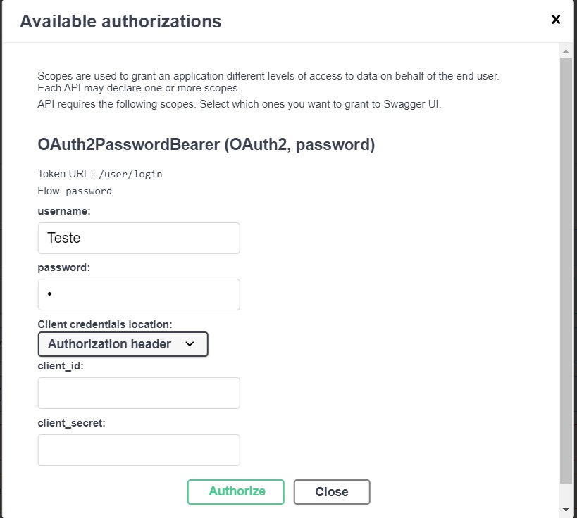<br>
  <br><br>
3.```Senha incorreta```
   <br>
  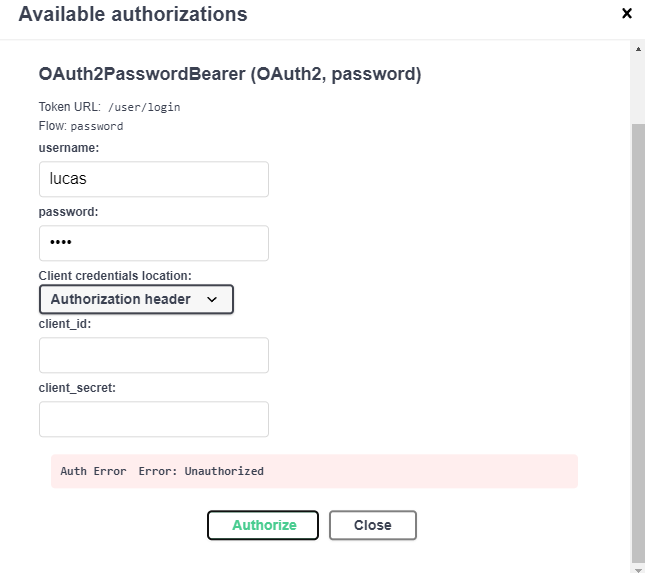<br>
  <br><br>
4.```Senha correta```
   <br>
  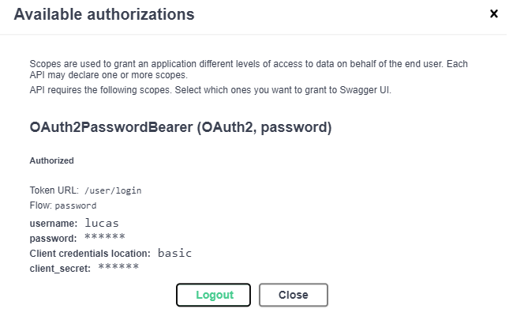<br>
  <br><br>
5.```Login```
  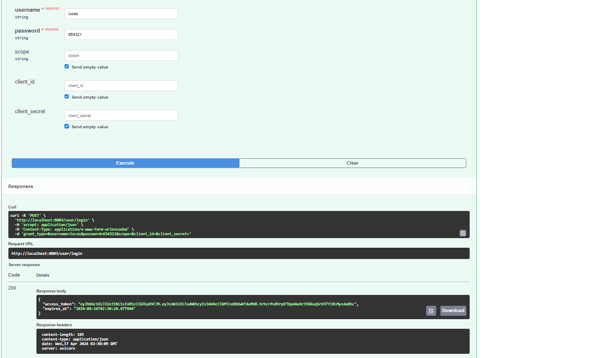<br>
  <br><br>
6.```Post setor```
    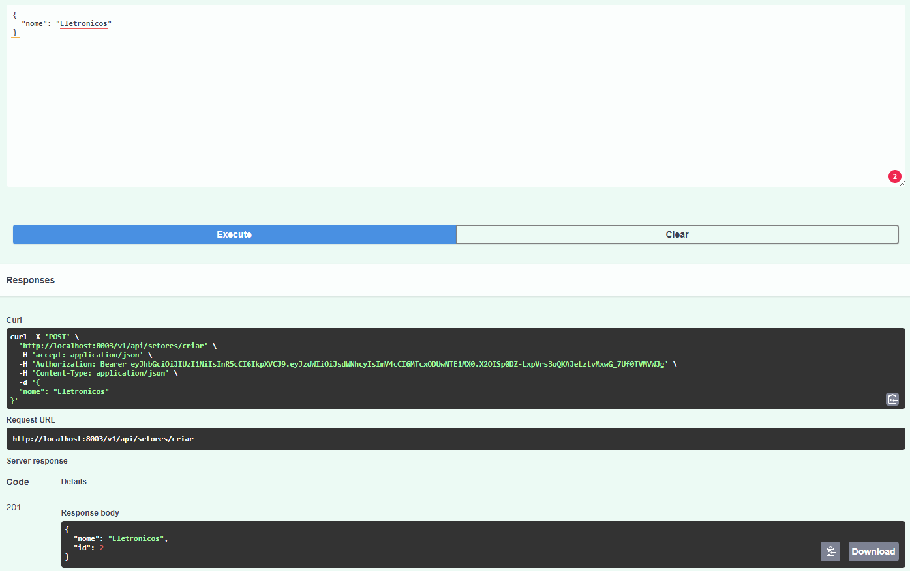<br>
  <br><br>
7.```Post produto```
 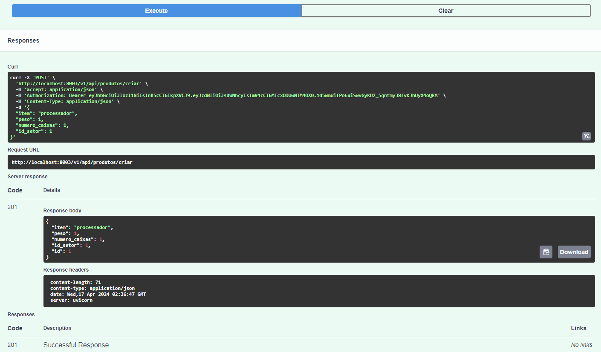<br>
  <br><br># Get Folder
